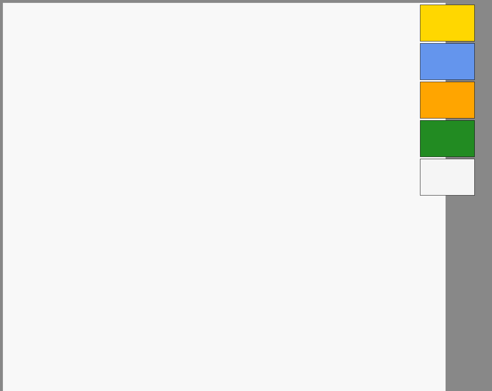
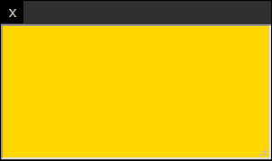

# Memocca

## 概要

 アカウント登録もなく、インスタントに使えるホワイトボードアプリのクライアントサイド実装です。
 **現行はα版につき、HTMLとPure JS・CSSの構成になっています。
後々、Vue.jsに移行の予定です。**

 以下のURLはデモサイトです。
 [https://stickyboards.netlify.app/](https://stickyboards.netlify.app/)

## 説明

- 付箋紙と手書き文字がかけるシンプルなホワイトボードアプリです。**（現行では付箋紙の追加のみ実装）**
- 用意してあるdocker-composeファイルを用いることで、ローカル・オンプレミス環境にセットアップ可能です。
なので、既存のサービスのように、機密情報を外部サーバーに置かれる心配がありません。
- 初回起動後に1つ、部屋が自動で作成されるので、URLを共有して、テレビ会議等ですぐに使えます。

## セットアップ

```bash

$ docker run -p "8080:8080" memocca

```

## 使い方


右端の付箋をクリックすると、付箋を追加できます。


付箋紙は、テキストの入力の他に、移動・リサイズ・削除ができます。
黒いバーをドラッグ＆ドロップすると、付箋紙を移動させることができます。
付箋紙を削除するときは、バーの左端のボタンをクリックします。
付箋紙のサイズを変更するには、右端の下をドラッグ＆ドロップしてください。

## ライセンス

未定
